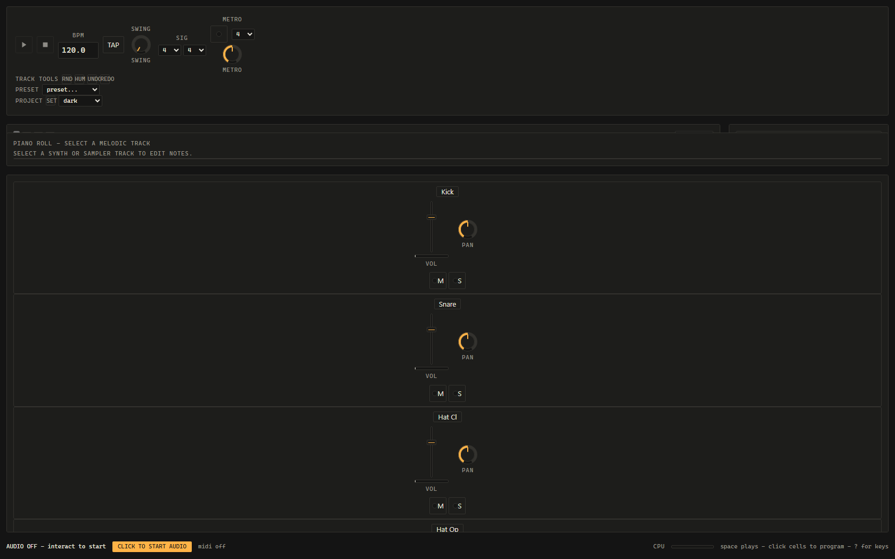

# Gridpulse

> **built with ox alpha**
>
> most of this was written in august 2026 during the free preview window of
> [ox alpha](https://openrouter.ai/stealth/ox-alpha), an anonymous stealth model
> that turned up on openrouter for about a week. i set the direction and reviewed
> what came back. the tests are real and they pass — clone it and run them.

A step sequencer that runs entirely in the browser on the Web Audio API, for musicians and hobbyists who want to program drum patterns and melodic lines without installing anything.



## Run

```sh
npm start          # serves http://localhost:8787 (no dependencies; plain Node)
```

Open http://localhost:8787, click anywhere once (browsers require a gesture before audio starts), press **Space**.

Run the automated test suite:

```sh
npm test           # node --test over tests/*.test.js
```

Browser-render checks (byte-identical offline renders, onset alignment) live in `tests/browser.html`; serve the repo (`npm start`) and open `http://localhost:8787/tests/browser.html` in Chrome.

## Programming a pattern

- The grid rows are tracks; columns are 16th-note steps. Click a cell to toggle it.
- `Shift+click` cycles velocity 40/70/100% (100% = accented), `Alt+click` cycles probability 100/50/25%, `Ctrl+click` cycles ratchet repeats.
- `[` / `]` nudge a focused step by ±10 ms (micro-timing).
- Tracks can have individual lengths (1–64 steps) — set length in a track header; different lengths create polyrhythms that realign every LCM.
- Melodic tracks get a piano roll below the grid; notes are constrained to the selected key/scale; Quantize snaps existing notes.
- Multiple patterns chain into a song via the SONG editor next to the pattern tabs.
- Undo/redo: Ctrl+Z / Ctrl+Y. Randomize/Humanize buttons apply bounded ranges to the selected track.

## Signal flow

Per track:

```
voice -> drive -> filter -> compressor --+-> pan -> fader --> master
                                         +-> delay send ---> shared tempo-synced delay -->+
                                         +-> reverb send -> shared algorithmic reverb --->+--> master bus -> limiter -> out
```

Delay time derives from transport BPM (16th divisions); the reverb is an algorithmic comb/allpass network — no sample files or impulse responses ship with the repo. Mute/solo are computed at the fader stage; meters read real post-fader signal.

## Sound sources

- Six synthesized drum pieces per kit track (kick, snare, closed/open hat, clap, tom) built from oscillators and seeded noise; each has editable parameters in the sound bay.
- A subtractive synth voice: wave selection incl. supersaw, filter with envelope, ADSR, glide (mono legato when glide > 0).
- A sampler track: load your own audio file (max 20 MB); tune/start/end/reverse parameters. Decode failures surface as named toasts, never dead ends.

## Project format

JSON, documented in [PROJECT_SCHEMA.md](PROJECT_SCHEMA.md): multiple patterns, per-track per-step `{on, vel, prob, ratchet, nudge, note}`, mixer + FX state, song chain, RNG seed (probability is deterministic under the seed). Save/load slots live in localStorage; export/import is a plain file; sampler audio can optionally be embedded as base64 WAV.

## Timing approach

All event times derive from `AudioContext.currentTime`. A lookahead scheduler (180 ms window) materializes events from a musical-time map anchored at tempo changes; ticks come from a Web Worker so background-tab timer throttling cannot starve scheduling. The playhead position is computed from the same map — never from wall-clock timers. Full contract: [TIMING_CONTRACT.md](TIMING_CONTRACT.md).

Measured claims (method: offline render onset detection vs scheduled times, and scheduler-vs-mocked-clock exactness over a simulated hour; environment noted per run) are recorded in [AUDIT.md](AUDIT.md).

## MIDI

- Input notes record into the selected melodic track at the playhead during playback (optional quantize to key/scale). There is no thru-monitoring: recorded notes sound on the next cycle — a deliberate consequence of the single-scheduler timing rule.
- MIDI clock can be sent while playing (24 PPQN aligned to the audio clock) and received: stable external clock adjusts BPM via the tempo-change mechanism (no dropped events).
- Pattern export writes a format-0 Standard MIDI File (drums mapped to channel 10).
- Limits: Web MIDI requires Chromium browsers (Chrome/Edge/Opera); Safari/Firefox lack full support or ship it behind flags. Permission denial degrades gracefully.

## Browser compatibility

| Browser | Status |
| --- | --- |
| Chrome/Edge desktop | Primary target; everything works. |
| Firefox | Web Audio + OfflineAudioContext fine; Web MIDI unavailable (settings shows unsupported). |
| Safari | Works generally; Web MIDI absent; some older builds have `decodeAudioData` callback quirks handled in code. |
| Mobile browsers | Layout adapts (larger touch cells); long-session stability untested — treat as experimental. |

## Keyboard reference

Press `?` in the app for the built-in map. Summary: Space play/stop · T tap · M metronome · `.` step-repeat performance mode (clicks set live retrigger targets, fed through the scheduler) · G focus grid · P focus piano roll · arrows navigate · Space/Enter toggle step · `[ ]` nudge · `{ }` probability · r ratchet · c/v copy/paste · Shift+click velocity · Alt+click probability · Ctrl+click ratchet · Ctrl+Z/Y undo/redo.

Accessibility: the grid exposes table semantics with per-cell state labels; themes include dark (default), light, high-contrast; `prefers-reduced-motion` replaces the continuous playhead with a discrete step indicator; AA contrast verified per theme in AUDIT.md.

## Architecture note

Zero runtime dependencies. Plain ES modules served statically. `src/core` holds pure, node-testable logic (model, schema, scales, musical-time math, RNG); `src/audio` holds context lifecycle, scheduler, voices, FX graph; `src/ui` component factories emit intents only — all audio scheduling funnels through the Scheduler (see TIMING_CONTRACT.md); `src/render` renders projects offline through `OfflineAudioContext` and encodes WAV directly (never by recording playback).

## License

MIT — see [LICENSE](LICENSE).